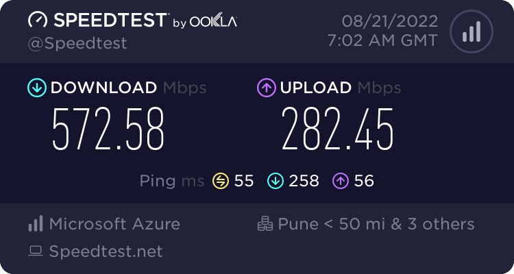

<!--end_excerpt-->
**Update (9th May 2023)**: As pointed out in the comments, use port 123 for UDP as 19302 no longer works. For future reference, use nmap to find open ports.

I wrote [this blog](https://anjaygoel.github.io/posts/IIT-KGP-Bypass-Internet-Restrictions/) a while ago describing how to host your own VPN server using GitHub student pack freebies to bypass the institute's network restrictions. But it didn't solve all my problems. Two major issues that I have since come to realize with this workaround are:

* Using your organization's VPN on the campus WiFi/LAN during the summers / while interning.
* Using UDP-based VPNs ( who doesn't want to squeeze every bit of speed from the high-speed Internet. )

In this post, I will show how to fix both problems.

## Using your organization's VPN

Many organizations use WireGuard, which uses UDP exclusively and doesn't work on campus WiFi/LAN. In some cases owing to the nature of the work, you will quickly burn through your mobile data, should you choose to use it. Let alone the issue of terribly slow mobile data speeds. Of course, you can't simply run both your personal & the Org's VPN simultaneously on the same device and expect it to work. But the solution is pretty similar. You just need to route your work device's Internet through another device with your own VPN enabled. A simple way is to **turn on the VPN and WiFi hotspot on a personal device and connect to it on the work device.**

* **Ubuntu** (or any Gnome-based desktop): The steps to turn on the hotspot are given [here](https://help.ubuntu.com/stable/ubuntu-help/net-wireless-adhoc.html.en). If you are using any other distro / DE, you can probably figure out the steps on your own.
* **Windows**: Follow the steps [here](https://support.nordvpn.com/Connectivity/Windows/1441319672/Share-VPN-via-a-mobile-hotspot-on-Windows-10.htm). Although the guide is for NordVPN, it should work with any other VPN too (Just select the appropriate adapter in step 4).
* **Android**: the solution will not work out of the box. As **android doesn't share the VPN with the hotspot**. Some workarounds are given in this [thread](https://android.stackexchange.com/questions/194255/is-it-possible-to-share-a-vpn-connection-over-wifi-hotspot) (tl;dr: You can use [this app](https://github.com/Mygod/VPNHotspot)), but they require the android device to be rooted.

## Using UDP based VPNs

Thanks to [@sheharyaar](https://github.com/sheharyaar/)'s [detailed analysis](https://github.com/sheharyaar/iit-kgp-network) and someone complaining (on one of the insti's anonymous FB pages) about why Google Meet works on campus WiFi/LAN despite it using UDP, I realized there isn't a blanket ban on UDP. Sure enough, connecting to a WireGuard server running on port `19302` (one of the ports used by Google Meet for UDP traffic as given [here](https://services.google.com/fh/files/blogs/enabling_remote_working_with_hangouts_meet_quick_deployment_guide.pdf)) worked. So, It is, in-fact possible to use WireGuard, granted it is running on an allowed port. For those interested, you can use [this script](https://github.com/angristan/wireguard-install) to quickly install a WireGuard server on a VM.

PS: You can set up the black-list / white-list in the [official WireGuard android app](https://play.google.com/store/apps/details?id=com.wireguard.android&hl=en_IN&gl=US) by clicking on `All Applications` on the profile settings page.

WireGuard speed test on LAN:

Now that we have figured out how to run WireGuard, I suspect there is a way to pass one WireGuard tunnel over the other. Thus removing the need to use a hotspot. If someone figures it out, please comment below.
