<!--end_excerpt-->

**Update: 4th June '21**: Checkout the code
used [here](https://github.com/AnjayGoel/Covid-19-Death-Registration-Trends).

**TL;DR**: You can [skip to the visualisations](#chennai) if you don't wanna read my ramblings.

&ensp;While the second wave of coronavirus may have died down, it raised several questions about our preparedness,
lock-down and vaccination policies and among them is the question of reliability of official figures.

&ensp; Whenever someone talks about coronavirus related numbers, one point that often comes up is of under-reporting,
and how the real stats may be several times of what is being reported. Given that we have all witnessed the devastating
effects of the second wave, these doubts are not unfounded. A common argument is that if we cannot certify all deaths in
time, we should be looking at excess deaths and death registrations to estimate the actual death toll. This is precisely
what I hope to do in this post.

## The Core Argument / Motivation

*&ensp;A unnatural spike in death registrations around the same time as the pandemic could be partially or wholly
attributed to coronavirus deaths.* While it can also be argued that deaths and death registrations may have a seasonal
component (as we will see later in the visualisations), to counter that, I have used data ranging from 2016 to present
in the analysis (or just call it some pretty data visualisation).

## Gathering The Data

### **1. Covid Stats**:

&ensp;For the Covid stats, I have used the data available at [Covid19India](https://covid19india.org). Although they
have all the sources listed, if you are sceptical about it.

### **2. Death Registrations**:

&ensp;So, through a quick google search for municipal corporations of most populated cities in India, I found that death
registration data was public available and easily accessible for three cities:

* Chennai
* Kolkata
* Delhi, saving it for the last.

&ensp; Hence I have confined my analysis to these cities. So please don't accuse me of cherry-picking :
slightly_smiling_face: . With a little python script involving some scraping, multiprocessing and SQL, I was able to
dump death registration data of the above cities for the past few years into nice little sqlite files. Grouping by date
of death and counting gave the time series.

## Quick Background And Points To Consider

* **Mortality Rate/ Death Rate**: Typically defined as deaths per thousand individuals per year. For India it varies in
  the range of 5-7, based on different geographies. More details can be found on
  the [census website](https://censusindia.gov.in/).

* **Level of registration**: Quoting from the census website:

  ```“Level of Registration” is defined as the number of events (birth, death, still birth) registered in a given area per hundred of the events available for registration in that area during the year. It describes the extent to which registration of such event in that area is complete. ```

  As of 2018, its 89.3% for births and 86.0% for deaths. Hence registered deaths may actually under count the real
  stats.

* **Exhaustiveness of data available online**: While I have made sure to scrape properly, and have made a comparison to
  the prevailing mortality rates and census data, there is a possibility that data available online may not be
  exhaustive. Nevertheless, the scenario of over-counting isn't possible. So the analysis at best is under-counting (
  within a margin of error, we will never know) but true (since its gathered from official sources).

**Note:** *The decline till zero (in all three cases in fact) in death registrations will be due to unavailability of
recent data, as deaths need to be registered, data in the systems need to be updated etc.*

## Shut Up And Let The Data Speak

Okay so here we go

### Chennai

The district has same boundaries as the Greater Chennai City. Good for us, no ambiguities there. So we are indeed
comparing data for same geography.

Fun fact, its the second oldest city civic body in the world after the City of London (Yes, I saw it on Wikipedia).

* **Population**: Around 7.1 Million
* **Daily deaths**:
    * **Expected Daily Deaths**: 142 (Using population and mortality rate)
    * **Census data (2018):** 62461/365 ~ 171
    * **Our Data (2018):** ~162, Can chalk it up to various factors, but pretty close, so it doesn't really matter.
      Implying the data is exhaustive.

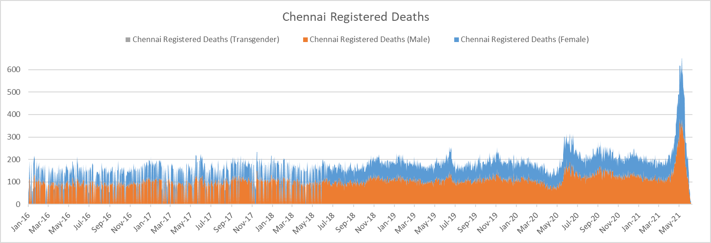

* Data appears to be a bit irregular pre May 2018, put smoothed out later. Nevertheless, We have already tallied with
  census data, so this is not a matter of concern.
* Visualisation doesn't suggest any significant seasonal component. Series normally oscillates around 170-200 range.


* The surge around the first Covid wave is very apparent. Interestingly a slight dip can be observed post national
  lockdown and pre first wave. Probably because lockdown reduced transmission of other deceased, prevented more
  accidental deaths etc.
* Daily deaths reached a peak of around 300 per day in first wave, and continued above 200 there after, until march
  2021, when unfortunately second wave stricked.


* Daily deaths reached a peak of ~600 mark during the second wave, decreasing then onward.

**Comparing to reported Covid death tolls:**

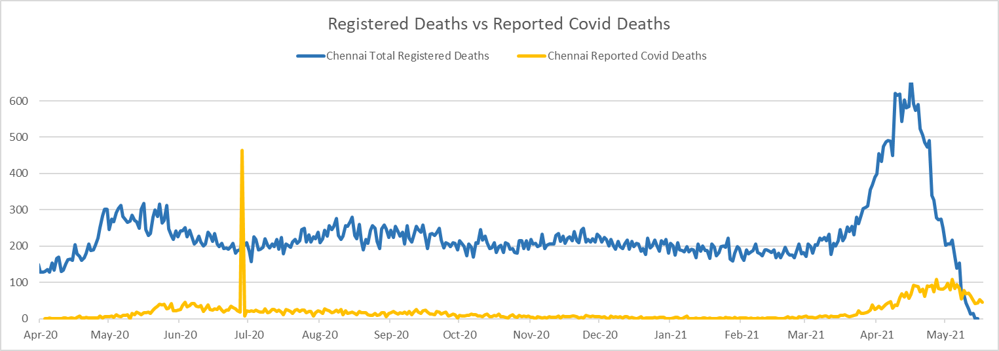

* The sudden spike in Jul-20 may be due to sudden accounting of Covid death tolls.

* While the death registrations reached 600 per day, up from 200 usual mark, The reported Covid death tolls barely
  crossed 100 per day. Implying the ***death tolls could be as high as 4x of whats been reported***

Lets add whole of Tamil Nadu for comparison:

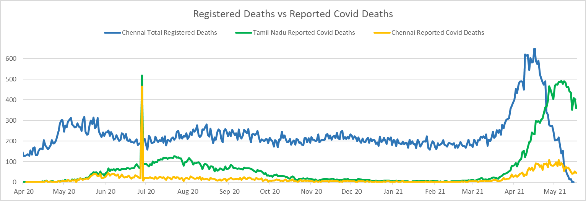

### Kolkata

Okay, this one was tough to figure out, apparently the "Kolkata District" covered by Kolkata municipal corporation is in
fact part of a much bigger "Kolkata
City" ([See Here](https://www.quora.com/What-is-the-difference-between-Kolkata-district-and-Kolkata-city-1)), which also
includes some parts of surrounding regions. Anyway Kolkata municipal corporation covers Kolkata district, that means we
are comparing stats for same geography.

* **Population**: Around 4.5 Million
* **Daily deaths**:

    * **Expected Daily Deaths**: 90 (Using population and mortality rate)
    * **Census data (2018):** 68090/365 ~ 186
    * **Our Data (2018):** ~190, pretty close

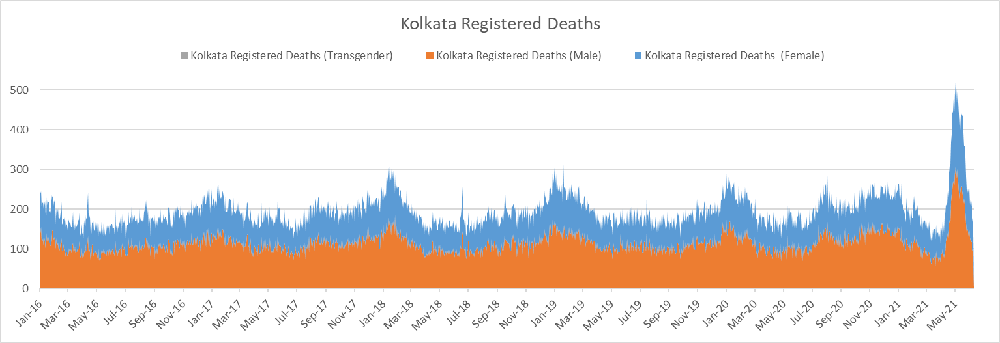

* Clear and strong seasonal trends can be observed for Kolkata death registrations, i.e. the spikes around start of the
  years. Again maybe due to winters.

* An increase in death registrations in July 2020 can be observed, followed by a few ups and downs before the final
  spike of April-May this year.


* Death registrations remained above 200 per day flowing July 2020, before dropping down to ~150 in March 2021,
  following which the second wave hit.

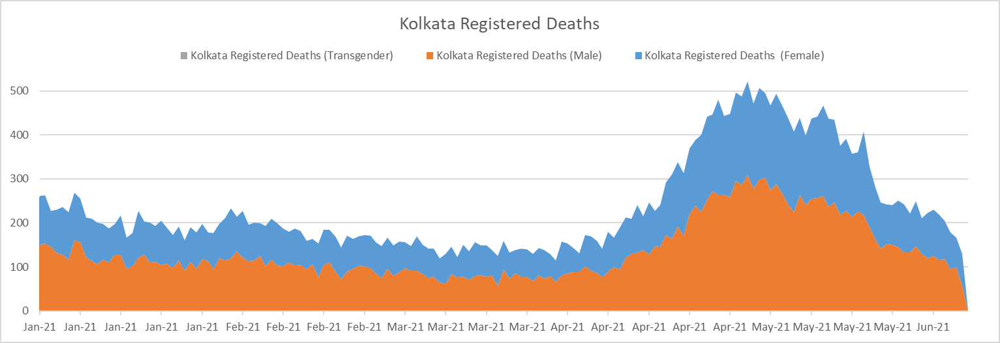

* During the second wave, the daily death registrations hit a peak of about 500 mark, decreasing then onward.

**Comparing it to reported Covid death tolls:**


* The sudden spike in April-20 may be due to sudden accounting of Covid death tolls.
* While the death registrations remained well above 200 per day for most of the 2020, reported Covid death tolls rarely
  crossed 20 in single day.
* When the second wave hit, death registrations peaked at ~500 per day, While the reported Covid death tolls barely
  crossed 40 death per day mark.
* This would imply that ***excess deaths are in fact ~7.5 the official death tolls during the second wave***.

Lets add whole of West Bengal for comparison, just for fun:

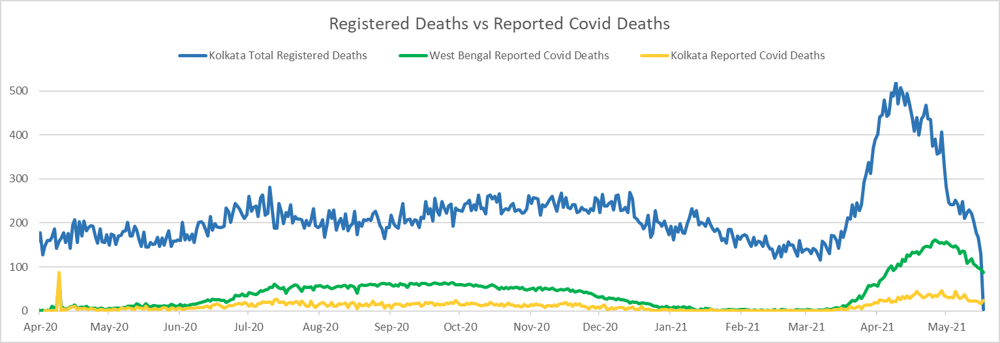

### Delhi

&ensp;Split into three separate municipal corporations, North, South and East (Missing west, annoying, I know) in 2012.
It encompasses whole of Delhi. So again no worries here, we are indeed comparing data for same geographies.

* **Population**: Around 11 Million

* **Daily deaths**:

    * **Expected Daily Deaths**: 220 (Using population and mortality rate)

    * **Census data (2018):** 145533/365 ~ 398

    * **Our Data (2018):** ~314

      The difference is census data and the scraped data is somewhat big, There could be tons of reasons, difference in
      areas covered, website not updated regularly etc (In fact the municipal corporation websites changed around may
      2020). The argument that we are undercounting at best still remains.

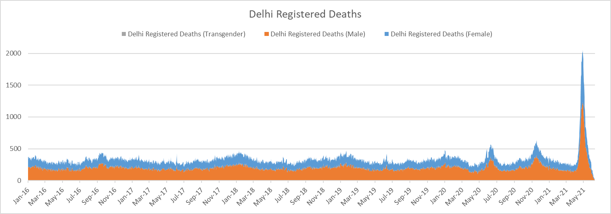

* Some seasonal components can be noticed. Minor spikes around start of the every year. Due to winter maybe.
* Series normally oscillates around 300-400 mark. Touching 500 around start of the years.
* Three spikes in 2020-2021 are clearly visible (Mid July 2020, Mid November 2020 and the mayhem of mid May 2021) .
* Here too a slight dip can be observed post national lockdown and pre first wave.

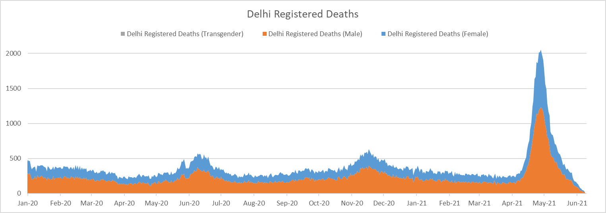

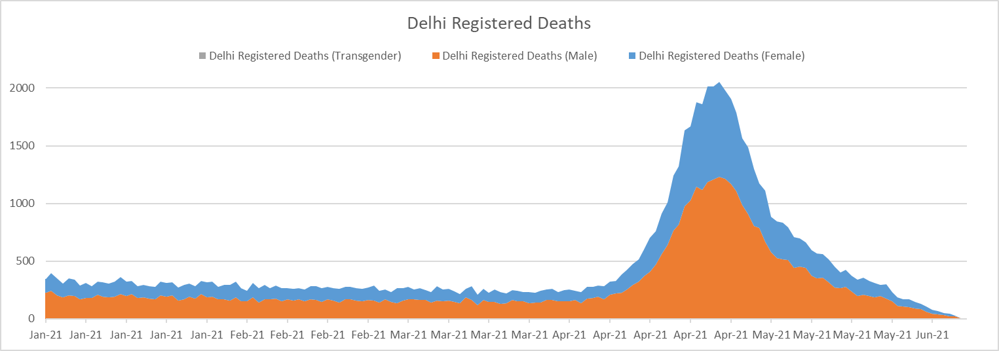

* Daily deaths reached a peak of around 2000 per day in May 2021.

**Comparing it to reported Covid death tolls:**

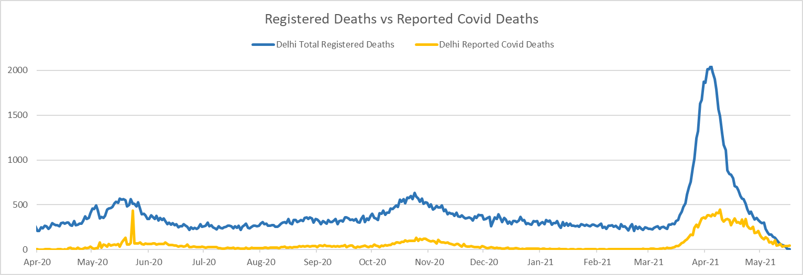

* The sudden spike in late may might be due to sudden accounting of Covid death tolls.
* The first spike of late may, death registrations nearly double, crossing the 500 mark. Official toll kept reporting a
  value in 60s and 70s, granted a big spike of around 400 once.
* The second spike of early November: Death registrations nearly double from ~ 300 to ~ 600, meanwhile the Covid tolls
  increase from 30-40 to ~120.
* The last huge wave: Death registrations surge from ~250 to crossing 2000 mark, while the tolls at peak reported 500
  deaths.
* In all the three cases ***spikes in death registrations are 3x-4x the official death tolls*.**

###### Bonus - Breakdown By Age.

* Deceased age was also available for Delhi. That adds another dimension to the analysis.

Pre Covid Age Distribution (2016-2020) of Deceased.

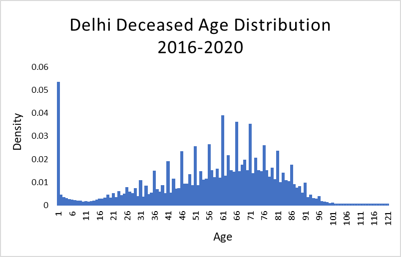

* The histogram has some irregular spikes, may be due to binning the data, or perhaps how age of deceased is reported,
  Anyway a spike on zero indicates infant moralities. Quite disheartening to see it surpass every age group.

* Now lets see the distribution overtime.

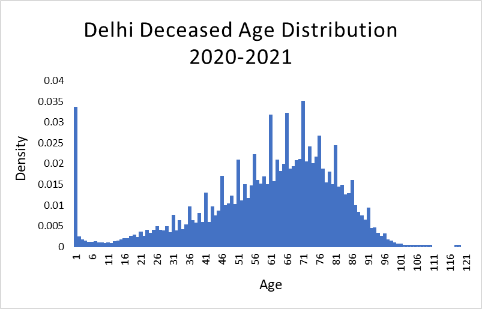

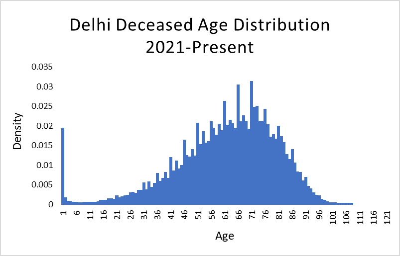

* A significant shift towards older age group can be observed.

###### Another Bonus - Composition Of Place Of Death

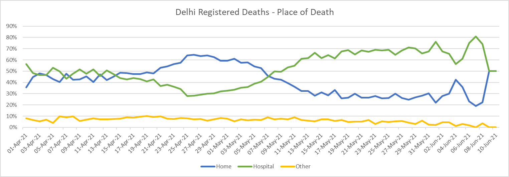

## Conclusion

&ensp;In all the three cities, the death registration trends suggest a far greater death toll than what's being reported;
in-fact several times the official figures, there is no reason to believe that similar patterns would not be shown for
rest of the country
